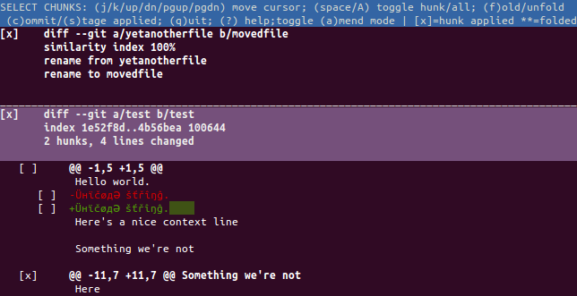

===========
Git crecord
===========

About
-----

**git-crecord** is a Git subcommand which allows users to interactively
select changes to commit or stage using a ncurses-based text user interface.
It is a port of the Mercurial crecord extension originally written by
Mark Edgington.

git-crecord allows you to interactively choose among the changes you have made
(with line-level granularity), and commit, stage or unstage only those changes
you select.
After committing or staging the selected changes, the unselected changes are
still present in your working copy, so you can use crecord multiple times to
split large changes into several smaller changesets.

Installation
------------

git-crecord assumes you have Python 2.7 installed as ``/usr/bin/python2``.

git-crecord ships with a setup.py installer based on setuptools.
To install git-crecord, simply type::

    ./setup.py install

This will install git-crecord itself, its manpage and this README file into
their proper locations.

Alternatively, to install it manually, symlink ``git-crecord`` into
the directory where Git can find it, which can be a directory in
your ``$PATH``::

    ln -s $PWD/git-crecord ~/.local/bin/git-crecord

Now you should have a new subcommand available for you.

When you're ready to commit some of your changes, type::

    git crecord

This will bring up a window where you can view all of your changes, and
select/de-select changes.
You can find more information on how to use it in the built-in help
(press the '?' key).

``git crecord`` supports most popular options of ``git commit``: ``--author=``,
``--date=``, ``--message=``, ``--amend``, ``--signoff``.

License
-------

This program is free software; you can redistribute it
and/or modify it under the terms of the GNU General Public
License as published by the Free Software Foundation; either
version 2 of the License, or (at your option) any later
version.

This program is distributed in the hope that it will be
useful, but WITHOUT ANY WARRANTY; without even the implied
warranty of MERCHANTABILITY or FITNESS FOR A PARTICULAR
PURPOSE.  See the GNU General Public License version 2
text for more details.

You should have received a copy of the GNU General Public
License along with this package; if not, write to the Free
Software Foundation, Inc., 51 Franklin St, Fifth Floor,
Boston, MA  02110-1301 USA

Authors
-------

For the list of contributors, see CONTRIBUTORS.

.. include:: CONTRIBUTORS
